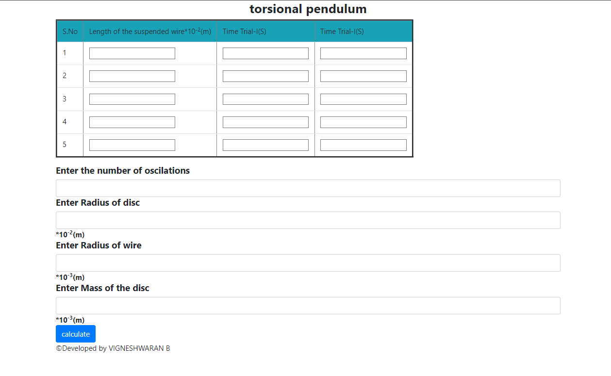

# Webpage for Physics Experiment Torsional Pendulum and Calculation

This webpage facilitates the collection of data for a physics experiment torsional pendulum involving the measurement  of various parameters and the calculation of important values. Users can input the following details:

## Input Parameters
- **Length of the Suspended Wire** (*10^-2 m*): Measurement of the suspended wire's length.
- **Time Trial I** (s): Time taken for the first trial.
- **Time Trial II** (s): Time taken for the second trial.
- **Number of Oscillations**: Number of oscillations observed.
- **Radius of the Disc** (*10^-2 m*): Measurement of the disc's radius.
- **Radius of the Wire** (*10^-3 m*): Measurement of the wire's radius.
- **Mass of the Disc**: Mass of the disc used in the experiment.

## Output Parameters
Upon entering the required details, the webpage will display the following calculated values:
- **Mean Time** (s): Calculated mean of the time trials.
- **Time Period** (s): Computed time period based on the oscillations and time data.
- **(L/T^2) Mean** (*10^-2 ms^-2*): Mean of the calculated L/T^2 values.
- **Moment of Inertia** (*10^-7 kgm^2*): Computed moment of inertia based on the provided parameters.

## Usage
1. Open the webpage - https://vigneshwaranbalamurugan.github.io/physics/ in a browser.
2. Fill in the required parameters as prompted.
3. Upon entering all values, the calculated outputs will be displayed automatically.

## Notes
- Ensure accurate measurements and inputs for precise calculations.
- Any NaN (Not a Number) values may occur due to incorrect or missing data.
  
 ## **Screenshots**
 

---
